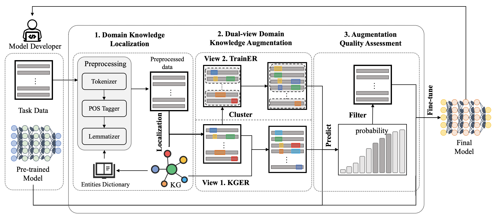

# KnowledgeDA

## KnowledgeDA Framework



## Requirements

* Python 3.6
* torch 1.8
* cuda 1.11
* nltk 3.6
* jieba  0.42.1
* synonyms 3.16.0
* scikit-learn 0.24.1
* ordered_set 4.0.2


## Quick Start

### Data Preparation

Unzip the files in `data` and  `KG`


### CMID (Chinese)

**Step 1**. Data augmentation

```python
cd ./Augment
python augment_kg_ch.py 
```

**Step 2**. BERT retraining with augmented data

```python
cd ./Classify
python bert_classify.py --dataname CMID --datatype knowledge --aug_num 5 --num_classes 4 --bert_path ../PLMs/BERT_base_chinese --seed 1
```


### SO-PLC (English)

**Step 1**. Data augmentation

```python
cd ./Augment
python augment_kg_en.py 
```

**Step 2**. BERT retraining with augmented data

```python
cd ./Classify
python bert_classify.py --dataname SO-PLC --datatype knowledge --aug_num 5 --num_classes 4 --bert_path ../PLMs/BERT_base --seed 1
```

